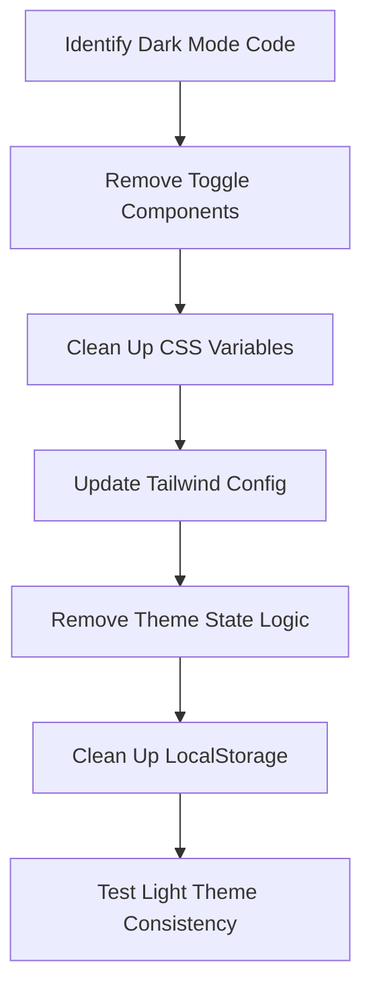

# Remove Dark Mode Feature Design

## Overview

This design documents the systematic removal of dark mode functionality from the wallpaper adhesive company website. The approach focuses on clean removal of all dark mode related code, styles, and configuration while maintaining the integrity of existing light theme styling.

## Steering Document Alignment

### Technical Standards (tech.md)
The removal follows the project's established React + TypeScript patterns and maintains the existing component structure. All changes will preserve type safety and follow the established ESLint configuration.

### Project Structure (structure.md)
The implementation respects the current file organization, maintaining separation between components, styles, and utilities. Removal will be performed systematically without disrupting the overall architecture.

## Code Reuse Analysis

### Existing Components to Leverage
- **Tailwind CSS Configuration**: Will be simplified to remove dark mode variants
- **React Components**: Will remain unchanged except for dark mode related props
- **CSS Variables**: Light theme variables will be preserved and cleaned up

### Integration Points
- **No Database Changes**: This is a frontend-only modification
- **No API Changes**: Backend functionality remains unaffected
- **No Storage Changes**: LocalStorage theme preferences will be removed

## Architecture

The removal strategy follows a systematic approach:



### Modular Design Principles
- **Single File Responsibility**: Each file will be cleaned of dark mode code independently
- **Component Isolation**: Dark mode logic will be removed without affecting component core functionality
- **Service Layer Separation**: Theme-related services will be completely removed
- **Utility Modularity**: Dark mode utility functions will be deleted

## Components and Interfaces

### Component 1: Theme Toggle Components
- **Purpose:** Complete removal of theme switching UI elements
- **Interfaces:** No interfaces - these components will be deleted
- **Dependencies:** These components depend on theme state which will be removed
- **Reuses:** N/A - These are standalone components being removed

### Component 2: Layout Components
- **Purpose:** Clean up any dark mode props or logic
- **Interfaces:** Existing interfaces preserved, dark mode props removed
- **Dependencies:** Dependencies remain unchanged except for theme context
- **Reuses:** Existing layout structure maintained

### Component 3: Styling Configuration
- **Purpose:** Remove dark mode CSS classes and variables
- **Interfaces:** Configuration file interfaces updated
- **Dependencies:** Tailwind CSS configuration updated
- **Reuses:** Existing light theme styles preserved

## Data Models

### Model 1: Theme State (REMOVED)
```
Previous theme state model - to be completely removed:
- isDarkMode: boolean
- toggleTheme: function
- theme: 'light' | 'dark'
```

### Model 2: CSS Variables (CLEANED)
```
CSS variables - dark mode variants removed:
- --color-background: #ffffff (light theme preserved)
- --color-text: #000000 (light theme preserved)
- Dark mode variables deleted
```

## Error Handling

### Error Scenarios
1. **Scenario 1: Dark mode classes still present in HTML
   - **Handling:** Comprehensive search and replace of dark mode class names
   - **User Impact:** None - users will only see light theme

2. **Scenario 2: Theme localStorage data remains
   - **Handling:** Clear any existing theme preferences from localStorage
   - **User Impact:** None - clean state ensures consistent light theme

3. **Scenario 3: CSS specificity issues after removal
   - **Handling:** Review CSS cascade to ensure light theme styles apply correctly
   - **User Impact:** None - proper testing ensures consistent appearance

## Testing Strategy

### Unit Testing
- Verify theme toggle components are completely removed
- Test that layout components render without theme props
- Validate CSS classes don't contain dark mode variants

### Integration Testing
- Test page rendering across all routes
- Verify component interaction without theme context
- Validate localStorage is clean of theme data

### End-to-End Testing
- Manual review of all pages for consistent light theme
- Test responsive behavior on mobile and desktop
- Verify accessibility with light theme color contrast