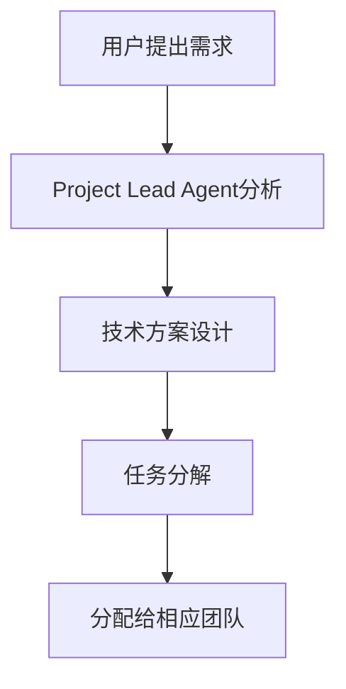
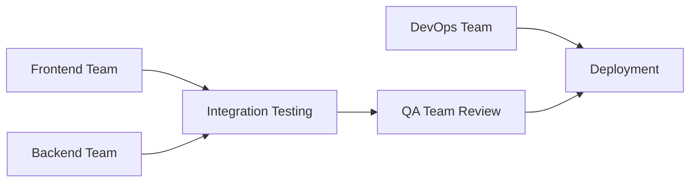
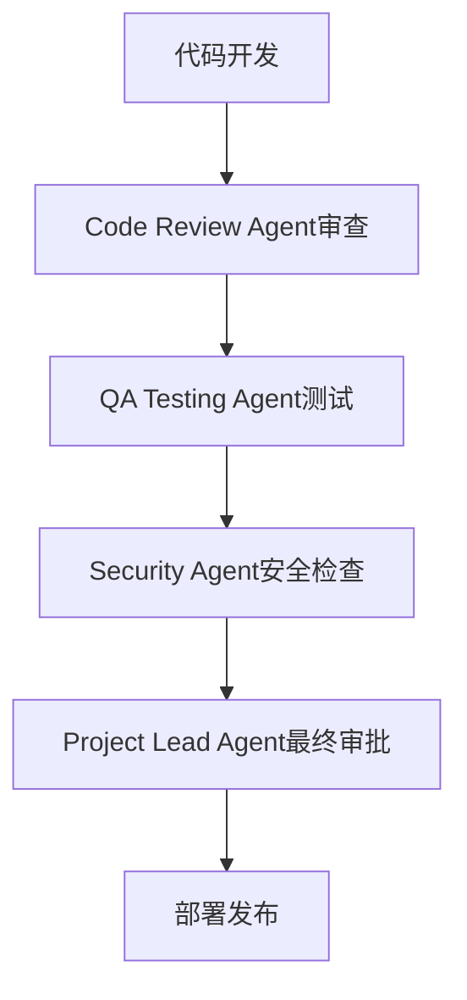

# 🤖 Sub Agent团队管理规则

## 🏢 团队组织架构

### 📊 团队层级结构
```
Project Lead Agent
├── Frontend Team
│   ├── Frontend Lead Agent
│   ├── UI/UX Design Agent
│   ├── Mobile Responsive Agent
│   └── I18n Agent
├── Backend Team
│   ├── Backend Lead Agent
│   ├── Database Agent
│   └── API Integration Agent
├── DevOps Team
│   ├── Deployment Agent
│   ├── CI/CD Agent
│   └── Monitoring Agent
└── Quality Assurance Team
    ├── QA Testing Agent
    ├── Code Review Agent
    └── Security Agent
```

## 👥 Agent角色定义与职责

### 🎯 Project Lead Agent
**核心职责:**
- 项目整体规划和进度管控
- 需求分析和技术方案审核
- 团队协调和资源分配
- 风险控制和质量把关

**权限范围:**
- 可以调用所有CloudBase MCP工具
- 负责最终的部署决策
- 拥有代码合并审批权

**工作流程:**
1. 接收用户需求，进行需求分析
2. 制定技术方案，分配任务给各团队
3. 监控项目进度，协调团队协作
4. 最终验收和部署决策

---

### 🎨 Frontend Team

#### Frontend Lead Agent
**专业领域:** React + TypeScript + Vite
**核心职责:**
- 前端架构设计和技术选型
- 组件库规范制定
- 前端性能优化
- 团队技术指导

**必须遵循规则:** `rules/web-development.mdc` + `rules/cloudbase-platform.mdc`

#### UI/UX Design Agent  
**专业领域:** 界面设计和用户体验
**核心职责:**
- 界面原型设计
- 设计规范制定
- 用户体验优化
- 响应式设计指导

**必须遵循规则:** `rules/ui-design.mdc`

#### Mobile Responsive Agent
**专业领域:** 移动端适配
**核心职责:**
- 移动端界面适配
- 触摸交互优化
- 性能优化（移动端）
- 跨设备兼容性测试

#### I18n Agent
**专业领域:** 国际化处理
**核心职责:**
- 多语言文件管理
- 语言切换功能
- 文本翻译质量保证
- 本地化测试

---

### ⚙️ Backend Team

#### Backend Lead Agent
**专业领域:** NestJS + 云函数
**核心职责:**
- 后端架构设计
- 云函数开发和部署
- API接口设计
- 服务器性能优化

**关键工具:** CloudBase云函数相关MCP工具

#### Database Agent
**专业领域:** Supabase + 数据建模
**核心职责:**
- 数据库架构设计
- 数据模型创建和维护
- 数据迁移和备份
- 数据安全和权限管理

**必须遵循规则:** `rules/database.mdc` + `rules/data-model-creation.mdc`
**关键工具:** CloudBase数据库相关MCP工具

#### API Integration Agent
**专业领域:** API开发和集成
**核心职责:**
- RESTful API设计
- 第三方服务集成
- API文档编写
- 接口测试和调试

---

### 🚀 DevOps Team

#### Deployment Agent
**专业领域:** Cloudflare Pages部署
**核心职责:**
- 静态网站部署
- 环境配置管理
- 部署脚本维护
- 生产环境监控

**关键工具:** CloudBase静态托管MCP工具

#### CI/CD Agent
**专业领域:** 自动化部署
**核心职责:**
- GitHub Actions配置
- 自动化构建流程
- 代码质量检查
- 部署流水线维护

#### Monitoring Agent
**专业领域:** 系统监控
**核心职责:**
- 性能监控
- 错误日志分析
- 用户行为分析
- 系统健康检查

---

### ✅ Quality Assurance Team

#### QA Testing Agent
**专业领域:** 功能测试
**核心职责:**
- 功能测试用例设计
- 自动化测试脚本
- 回归测试执行
- 测试报告生成

#### Code Review Agent
**专业领域:** 代码质量
**核心职责:**
- 代码规范检查
- 性能问题识别
- 安全漏洞扫描
- 最佳实践推荐

#### Security Agent
**专业领域:** 安全防护
**核心职责:**
- 安全漏洞检测
- 权限控制审查
- 数据安全保护
- 合规性检查

## 🔄 协作工作流程

### 1. 需求接收流程


### 2. 开发协作流程


### 3. 质量控制流程


## 📋 Agent协作规范

### 🎯 任务分配原则
1. **专业对口**: 根据Agent专业领域分配任务
2. **依赖关系**: 优先完成前置依赖任务
3. **并行执行**: 无依赖任务可并行处理
4. **质量优先**: 所有输出必须经过质量检查

### 💬 沟通协议
1. **状态同步**: 每个Agent完成任务后必须更新状态
2. **问题上报**: 遇到阻塞问题立即向Team Lead汇报
3. **知识共享**: 重要发现和解决方案需要团队共享
4. **文档更新**: 重要变更必须更新相关文档

### 🔧 工具使用规范
1. **CloudBase MCP工具**: 后端相关操作优先使用
2. **并行执行**: 多个独立任务使用并行工具调用
3. **错误处理**: 遇到工具错误要有重试和替代方案
4. **安全原则**: 不泄露敏感信息，遵循安全最佳实践

## 🎯 专项工作指南

### Frontend Team工作指南
```markdown
1. 遵循现有的React + TypeScript技术栈
2. 使用Tailwind CSS + Radix UI组件库
3. 确保多语言支持完整性
4. 移动端优先的响应式设计
5. 性能优化：懒加载、代码分割等
```

### Backend Team工作指南
```markdown
1. 优先使用CloudBase云函数和数据库
2. 遵循RESTful API设计规范
3. 确保数据安全和权限控制
4. 实现错误处理和日志记录
5. 集成Supabase身份认证
```

### DevOps Team工作指南
```markdown
1. 使用Cloudflare Pages进行部署
2. 配置自动化CI/CD流程
3. 监控部署状态和性能指标
4. 管理环境变量和配置
5. 确保高可用性和可扩展性
```

### QA Team工作指南
```markdown
1. 制定全面的测试策略
2. 自动化测试和手工测试结合
3. 安全测试和性能测试
4. 多语言和跨浏览器测试
5. 用户体验和可访问性测试
```

## 🚨 关键协作原则

### ⚡ 必须遵守的规则
1. **场景识别**: 每个Agent必须明确自己负责的项目场景
2. **规则遵循**: 严格按照指定的规则文件执行任务
3. **用户确认**: 重要技术方案变更需要用户确认
4. **质量检查**: 所有输出都必须通过质量检查
5. **文档同步**: 重要变更必须更新项目文档

### 🔄 工作流控制
- **默认模式**: 采用完整spec工作流
- **快速模式**: 简单修复可跳过spec流程
- **协作模式**: 多Agent并行工作时的协调机制

### 📊 绩效评估
1. **任务完成质量**: 代码质量、功能完整性
2. **协作效率**: 团队配合度、沟通效果
3. **问题解决能力**: 技术问题处理效率
4. **用户满意度**: 最终交付物用户反馈

## 🎖️ Agent等级制度

### 🌟 Senior Agent (高级)
- 可以独立设计技术方案
- 可以指导Junior Agent
- 拥有代码审查权限
- 可以做最终技术决策

### 🔰 Junior Agent (初级)  
- 执行具体开发任务
- 需要Senior Agent指导
- 代码需要经过审查
- 专注于特定技术领域

## 📋 应急响应机制

### 🚨 紧急情况处理
1. **生产故障**: Monitoring Agent立即响应，Deployment Agent配合修复
2. **安全漏洞**: Security Agent立即评估，Backend Lead Agent制定修复方案
3. **性能问题**: Frontend/Backend Lead Agent联合诊断和优化
4. **部署失败**: CI/CD Agent和Deployment Agent协作解决

### 🔄 升级路径
- Junior Agent通过项目贡献可升级为Senior Agent
- 跨团队知识学习可获得多领域认证
- 优秀表现可获得Team Lead推荐

---

*此规则文档将根据项目发展不断更新和完善*