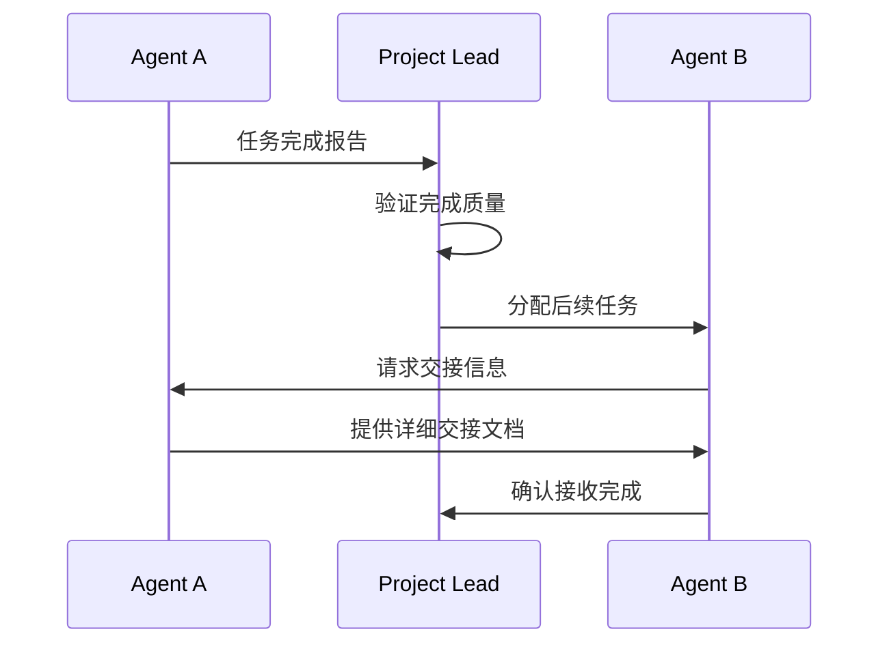
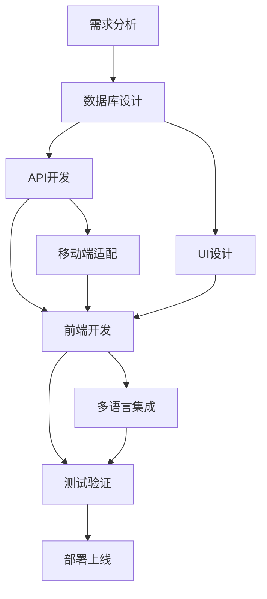
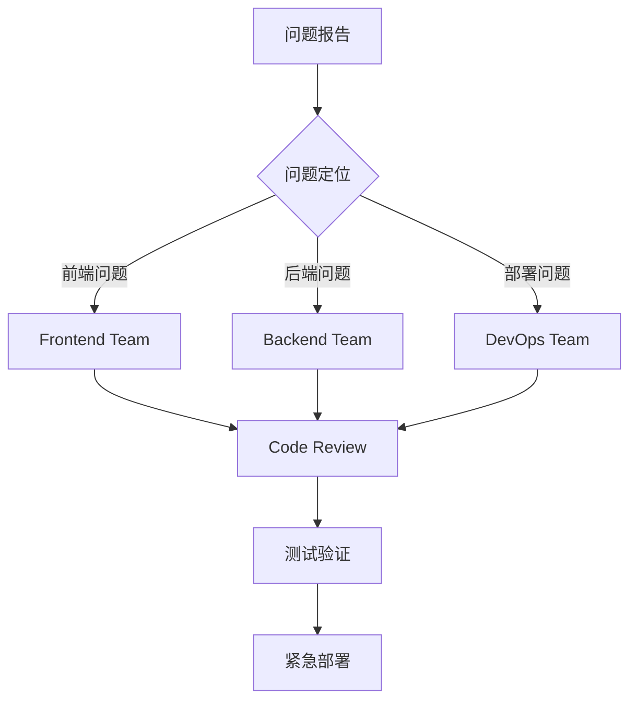
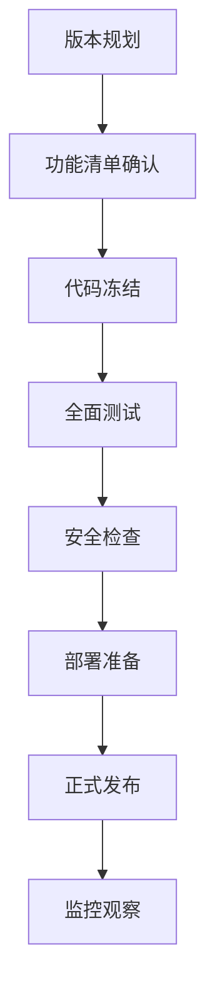

# 📱 Sub Agent沟通协议与协作规范

## 🗣️ 沟通协议标准

### 📋 状态报告格式
每个Agent在执行任务时必须使用统一的状态报告格式：

```markdown
## Agent状态报告
**Agent角色**: [具体角色名称]
**任务ID**: [任务编号]
**当前状态**: [进行中/已完成/遇到问题/等待依赖]
**完成进度**: [百分比]
**遇到问题**: [具体问题描述，如无则写"无"]
**下一步计划**: [下一步具体行动]
**需要协助**: [是否需要其他Agent配合，如无则写"无"]
```

### 🔄 任务交接协议


## 🎭 Agent间协作模式

### 1. 🔄 依赖链协作
**适用场景**: 有明确先后顺序的任务

**流程**:
```
Database Agent (数据模型) → API Integration Agent (接口开发) → Frontend Lead (前端集成)
```

**协作规范**:
- 上游Agent完成后立即通知下游Agent
- 提供详细的交接文档和测试数据
- 下游Agent确认接收后才算任务交接完成

### 2. ⚡ 并行协作  
**适用场景**: 可以同时进行的独立任务

**流程**:
```
UI/UX Design Agent (界面设计) || Mobile Responsive Agent (移动适配) || I18n Agent (国际化)
```

**协作规范**:
- 各Agent独立执行，定期同步进度
- 使用共享文档记录设计决策
- 遇到冲突时升级给Team Lead协调

### 3. 🤝 协同协作
**适用场景**: 需要多个Agent同时参与的复杂任务

**流程**:
```
Frontend Lead + Backend Lead + Database Agent (全栈功能开发)
```

**协作规范**:
- 建立临时协作小组
- 指定协作组长负责协调
- 使用共享工作空间
- 日常站会同步进度

## 📞 沟通渠道管理

### 🏢 正式沟通渠道
1. **项目文档**: 所有重要决策和变更记录在项目文档中
2. **状态报告**: 使用TodoWrite工具记录任务进度
3. **技术方案**: 重要技术方案需要文档化并存档

### 💬 非正式沟通渠道  
1. **即时协作**: Agent间直接沟通解决快速问题
2. **知识分享**: 共享最佳实践和解决方案
3. **经验交流**: 跨团队技术交流和学习

## 🎯 具体协作场景

### 🔧 场景1: 新功能开发


**参与Agent**: Database Agent → API Integration Agent → UI/UX Design Agent → Frontend Lead → Mobile Responsive Agent → I18n Agent → QA Testing Agent → Deployment Agent

### 🐛 场景2: Bug修复


**参与Agent**: 相关开发Agent → Code Review Agent → QA Testing Agent → Deployment Agent

### 🔄 场景3: 版本发布


**参与Agent**: Project Lead → 所有开发Agent → QA Testing Agent → Security Agent → Deployment Agent → Monitoring Agent

## 📝 文档协作规范

### 📚 文档分类
1. **技术文档**: API文档、架构文档、代码注释
2. **过程文档**: 需求文档、设计文档、测试报告
3. **管理文档**: 项目计划、进度报告、问题跟踪

### ✍️ 文档维护责任
- **Frontend Team**: 维护前端技术文档和组件文档
- **Backend Team**: 维护API文档和数据库文档
- **DevOps Team**: 维护部署文档和运维手册
- **QA Team**: 维护测试文档和质量报告

### 🔄 文档更新流程
1. **变更触发**: 代码变更自动触发文档更新检查
2. **责任确认**: 相关Agent负责更新对应文档
3. **审查确认**: Project Lead审查文档变更
4. **版本控制**: 重要文档变更需要版本标记

## 🚨 冲突解决机制

### 冲突类型与解决方案

#### 🎨 技术方案冲突
**解决流程**: 
1. Agent间技术讨论
2. Team Lead仲裁
3. Project Lead最终决策
4. 用户确认（重大变更）

#### ⏰ 进度冲突
**解决流程**:
1. 重新评估任务优先级
2. 调整资源分配
3. 并行任务重新规划
4. 延期风险评估和用户沟通

#### 🔧 技术实现冲突
**解决流程**:
1. 技术POC验证
2. 性能和可维护性评估
3. 团队投票决策
4. 统一技术标准

## 📈 持续改进流程

### 🔍 每日检查点
- **上午**: 各Team Lead同步昨日进度和今日计划
- **下午**: Project Lead检查整体进度和风险点
- **晚上**: 各Agent更新任务状态和遇到的问题

### 📊 每周回顾
1. **成果展示**: 各团队展示本周完成的功能
2. **问题分析**: 分析遇到的问题和解决方案
3. **流程优化**: 基于实践优化协作流程
4. **下周规划**: 制定下周的工作重点

### 🎯 里程碑评估
- **功能里程碑**: 关键功能完成度评估
- **质量里程碑**: 代码质量和测试覆盖率评估
- **性能里程碑**: 性能指标和用户体验评估
- **部署里程碑**: 部署稳定性和可用性评估

## 🏆 激励机制

### 🌟 优秀表现认定
1. **技术创新**: 提出创新解决方案
2. **协作精神**: 主动帮助其他Agent
3. **质量保证**: 输出零缺陷代码
4. **效率提升**: 提高团队整体效率

### 🎖️ 成长路径
- **技能认证**: 通过项目实践获得技能认证
- **角色升级**: 从Junior升级到Senior，再到Team Lead
- **跨域发展**: 学习其他领域技能，成为全栈Agent
- **专家路径**: 在特定领域成为技术专家

---

*协作愉快！让我们一起构建高质量的项目！* 🚀