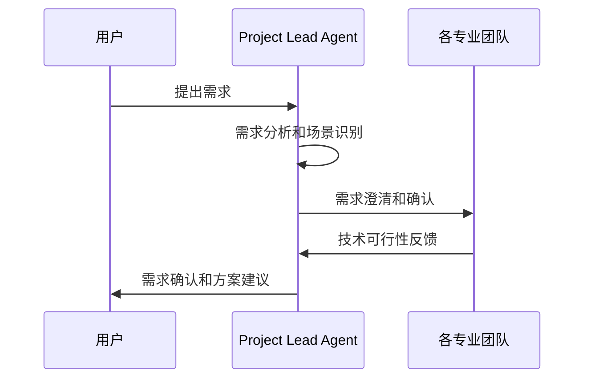
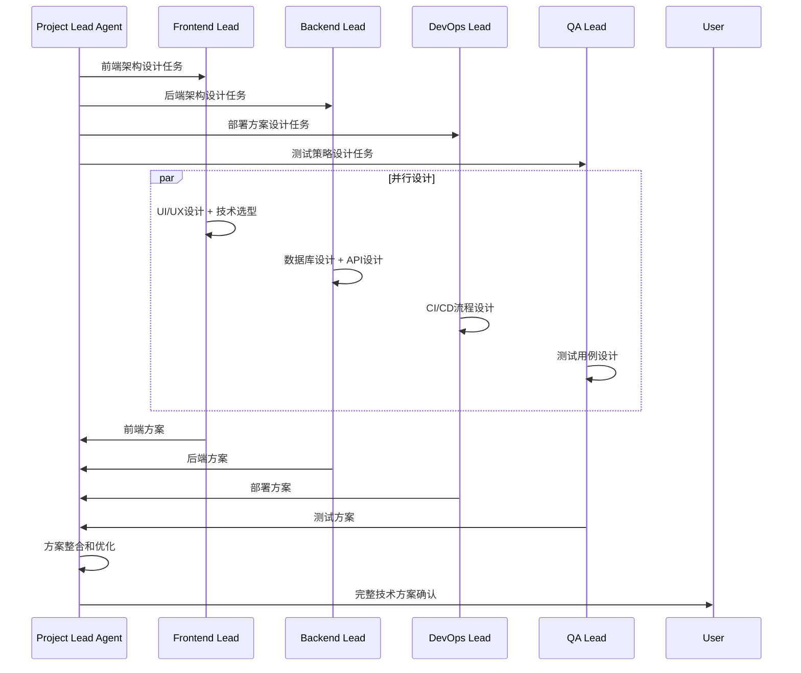
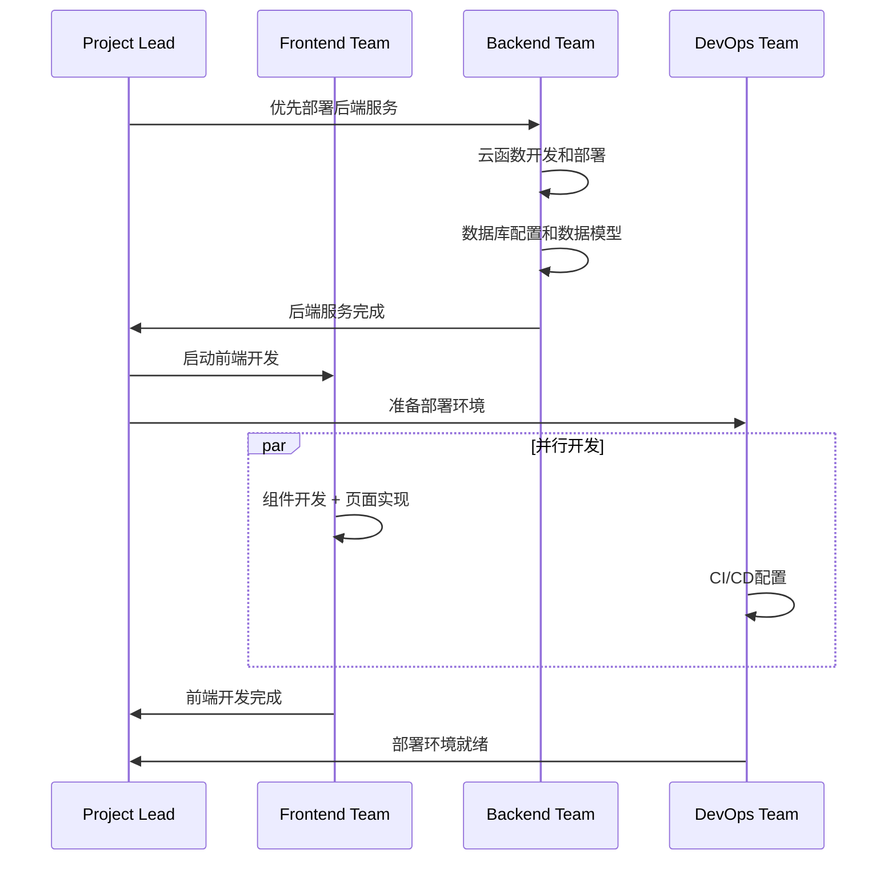
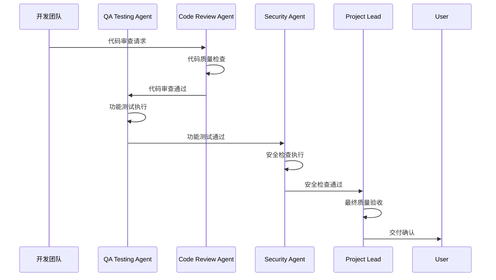
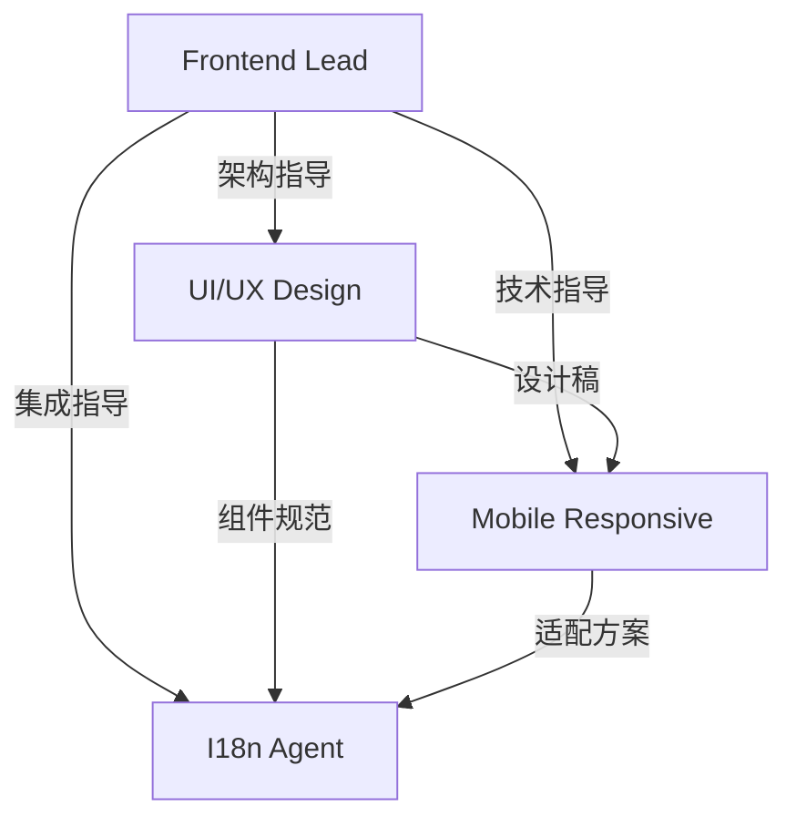
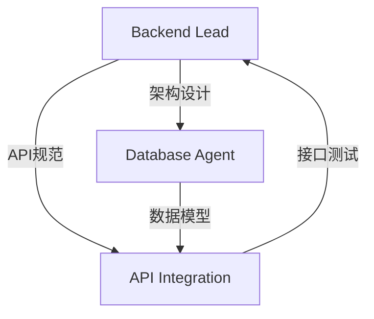
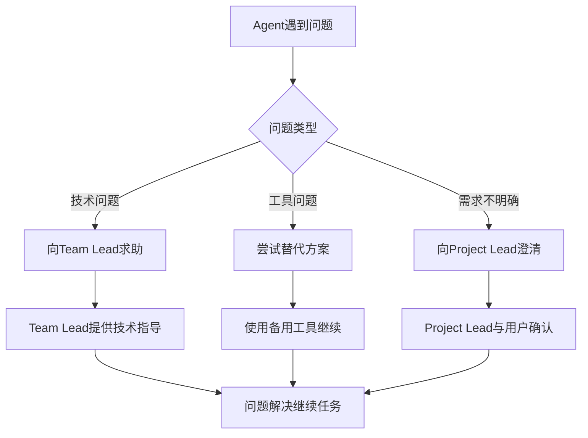

# 🔄 Sub Agent协作流程与工作规范

## 🎯 核心协作原则

### 1. 🚀 效率优先原则
- **并行执行**: 无依赖关系的任务必须并行处理
- **工具优化**: 优先使用批量工具调用，减少等待时间
- **状态同步**: 实时更新任务状态，避免重复工作

### 2. 🎨 质量保障原则  
- **代码审查**: 所有代码变更必须经过Code Review Agent审查
- **测试覆盖**: 新功能必须包含完整的测试用例
- **文档同步**: 重要变更必须同步更新相关文档

### 3. 🔐 安全防护原则
- **权限最小化**: Agent只拥有必要的操作权限
- **敏感信息保护**: 不在代码中硬编码敏感数据
- **安全扫描**: Security Agent对所有代码进行安全检查

## 📋 标准工作流程

### 🎪 Phase 1: 需求分析阶段

**Project Lead Agent职责:**
1. 接收用户需求，识别项目场景类型
2. 根据场景选择适用的规则文件
3. 向用户确认理解的正确性
4. 制定初步技术方案

### 🏗️ Phase 2: 技术设计阶段

### 🛠️ Phase 3: 开发实施阶段

### ✅ Phase 4: 测试验收阶段

## 🎭 Agent专业分工细则

### Frontend Team内部协作

**协作规范:**
- Frontend Lead负责技术架构决策
- UI/UX Design Agent先出设计稿
- Mobile Responsive Agent基于设计稿进行适配
- I18n Agent负责多语言实现

### Backend Team内部协作

**协作规范:**
- Backend Lead制定整体架构
- Database Agent优先设计数据模型
- API Integration Agent基于数据模型开发接口
- 所有后端变更需Backend Lead最终确认

## ⚙️ 工具使用分配

### CloudBase MCP工具分配表
| Agent角色 | 主要工具 | 权限级别 |
|----------|---------|---------|
| Project Lead | 所有工具 | 完全权限 |
| Backend Lead | 云函数、数据库工具 | 高权限 |
| Database Agent | 数据库、数据模型工具 | 专业权限 |
| Deployment Agent | 静态托管、域名工具 | 部署权限 |
| Security Agent | 安全规则工具 | 只读权限 |

### 工具调用优先级
1. **高优先级**: 云函数部署、数据库操作
2. **中优先级**: 静态托管、域名配置
3. **低优先级**: 查询类、监控类操作

## 🔔 异常处理机制

### 常见问题解决流程

### 升级机制
1. **Level 1**: Agent内部解决
2. **Level 2**: Team Lead介入
3. **Level 3**: Project Lead协调
4. **Level 4**: 向用户寻求帮助

## 📊 质量度量标准

### 代码质量指标
- **代码覆盖率**: >80%
- **ESLint检查**: 0错误，0警告
- **TypeScript检查**: 无类型错误
- **性能评分**: Lighthouse >90分

### 协作效率指标
- **任务完成率**: >95%
- **平均响应时间**: <2分钟
- **问题解决率**: >90%
- **用户满意度**: >4.5/5星

## 🎓 持续改进机制

### 知识库建设
1. **经验总结**: 每个项目结束后总结最佳实践
2. **问题库**: 建立常见问题和解决方案库
3. **模板库**: 沉淀可复用的代码模板和配置
4. **培训材料**: 为新Agent提供培训文档

### 流程优化
1. **定期回顾**: 每周团队回顾会议
2. **流程改进**: 基于反馈优化协作流程
3. **工具升级**: 跟进新工具和技术趋势
4. **规则更新**: 根据项目经验更新规则文档

---

*本工作流程文档是活文档，将根据项目实践不断优化更新*