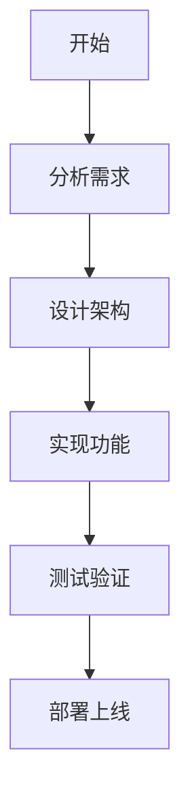

# BMAD 多代理协作系统 - 快速入门指南

## ✅ 集成状态

BMAD 系统已成功集成到墙纸胶企业官网项目中！

### 集成内容
- ✅ `_bmad/` 核心系统目录
- ✅ `_bmad-output/` 输出目录
- ✅ `.spec-workflow/` 模板更新
- ✅ `CLAUDE.md` 文档更新
- ✅ BMM 配置文件定制

## 🚀 快速开始

### 1. 了解可用的工作流

#### 📊 分析阶段工作流
- **create-product-brief**: 产品简报 - 协作产品发现
- **research**: 研究 - 市场、技术、领域深度研究

#### 📋 规划阶段工作流
- **prd**: 产品需求文档 - 三模态工作流（创建/验证/编辑）
- **create-ux-design**: UX设计 - 用户体验模式和设计规划

#### 🏗️ 解决方案阶段工作流
- **check-implementation-readiness**: 实现就绪检查 - 对抗性验证
- **create-architecture**: 架构设计 - 协作架构决策
- **create-epics-and-stories**: Epic和Story创建 - 需求转换

#### 💻 实现阶段工作流
- **sprint-planning**: Sprint规划 - 生成跟踪状态
- **create-story**: 创建Story - 增强上下文
- **dev-story**: 开发Story - TDD实现
- **code-review**: 代码评审 - 对抗性评审（发现3-10个问题）
- **correct-course**: 航向修正 - 重大变更导航
- **sprint-status**: Sprint状态 - 总结和路由
- **retrospective**: 回顾会议 - 经验教训

#### ⚡ 快速工作流
- **quick-spec**: 快速规范 - 对话式规范工程
- **quick-dev**: 快速开发 - 灵活执行
- **document-project**: 项目文档化 - 现有代码库分析

#### 🎨 设计工作流
- **create-excalidraw-diagram**: 系统图（架构、ERD、UML）
- **create-excalidraw-flowchart**: 流程图
- **create-excalidraw-dataflow**: 数据流图
- **create-excalidraw-wireframe**: 线框图

#### 🧪 测试架构工作流
- **testarch-framework**: 测试框架初始化
- **testarch-attdb**: 验收测试驱动开发
- **testarch-test-design**: 系统可测试性评审
- **testarch-automate**: 测试自动化扩展
- **testarch-nfr`: 非功能性需求评估

#### 🎉 特殊工作流
- **brainstorming**: 头脑风暴 - 交互式创意会议
- **party-mode**: 派对模式 - 多代理讨论编排

### 2. 10个专业化代理

| 代理代码 | 角色 | 中文名 | 专业领域 |
|---------|------|--------|----------|
| bmad-master | Orchestrator | 总控代理 | 任务执行、工作流协调 |
| analyst | Business Analyst | 业务分析师 | 市场研究、需求分析 |
| architect | System Architect | 系统架构师 | 分布式系统、技术设计 |
| dev | Developer | 开发工程师 | Story执行、TDD |
| pm | Product Manager | 产品经理 | PRD、用户访谈 |
| sm | Scrum Master | 敏捷大师 | Sprint规划、Story准备 |
| tea | Test Architect | 测试架构师 | API测试、CI/CD |
| tech-writer | Technical Writer | 技术文档工程师 | 文档、CommonMark |
| ux-designer | UX Designer | UX设计师 | 用户研究、交互设计 |
| quick-flow-solo-dev | Full-Stack Dev | 全栈开发 | 快速流、精益实现 |

### 3. 典型使用场景

#### 场景A: 开发新功能（标准流程）
```
用户: "我要为网站添加产品比较功能"

AI 引导流程:
1. create-product-brief → 产品简报
2. research → 市场和技术研究
3. prd → 产品需求文档
4. create-ux-design → UX设计
5. check-implementation-readiness → 就绪检查
6. create-architecture → 架构设计
7. create-epics-and-stories → Epic/Story拆分
8. sprint-planning → Sprint规划
9. create-story → 创建Story
10. dev-story → TDD开发
11. code-review → 代码评审
12. retrospective → 回顾总结
```

#### 场景B: 快速功能实现
```
用户: "帮我快速添加一个联系表单验证"

AI 引导流程:
1. quick-spec → 快速规范
2. quick-dev → 快速开发
```

#### 场景C: 分析现有代码
```
用户: "帮我分析并文档化管理后台系统"

AI 引导流程:
document-project → 自动分析并生成文档
```

#### 场景D: 头脑风暴
```
用户: "我们来头脑风暴一下新的SEO策略"

AI 引导流程:
brainstorming → 多代理创意讨论
```

### 4. 如何启动工作流

#### 方法1: 直接描述需求
```
用户: "我要开始一个新功能：产品视频展示"
AI: 识别需求 → 推荐工作流 → 开始执行
```

#### 方法2: 明确指定工作流
```
用户: "启动 prd 工作流"
AI: 加载 prd 工作流 → 执行步骤
```

#### 方法3: 快速流程
```
用户: "快速实现：添加产品收藏功能"
AI: 使用 quick-spec → quick-dev
```

### 5. 关键规则（必须遵守）

#### Step-File 架构原则
- ✅ **微文件设计**: 每个步骤是自包含的指令文件
- ✅ **即时加载**: 只加载当前步骤 - 绝不预加载未来步骤
- ✅ **顺序执行**: 按顺序执行步骤，不跳过或优化
- ✅ **状态跟踪**: 更新 `stepsCompleted` 数组
- ✅ **追加构建**: 通过追加内容构建文档

#### 🛑 严格禁止（NO EXCEPTIONS）
- 🚫 **绝不**同时加载多个步骤文件
- 📖 **总是**在执行前完整读取步骤文件
- 🚫 **绝不**跳过步骤或优化顺序
- 💾 **总是**在写入步骤输出时更新 frontmatter
- 🎯 **总是**遵循步骤文件中的确切指令
- ⏸️ **总是**在菜单处暂停并等待用户输入
- 📋 **绝不**从未来步骤创建心理待办清单

### 6. 输出文件位置

```
_bmad-output/
├── planning-artifacts/         # 规划产物
│   ├── product-briefs/         # 产品简报
│   ├── prds/                   # PRD文档
│   ├── architectures/          # 架构文档
│   ├── epics/                  # Epic文档
│   └── stories/                # Story文档
└── implementation-artifacts/   # 实现产物
    ├── sprint-status/          # Sprint状态
    ├── story-implementation/   # Story实现
    └── reviews/                # 评审文档
```

### 7. 文档标准

所有文档必须遵循 **CommonMark 规范**：

#### ✅ 正确示例
```markdown
# 一级标题（空格后无#）

## 二级标题

### 三级标题

**粗体文本**
*斜体文本*

- 列表项1
- 列表项2
- 列表项3

`代码`

```
代码块
```

[链接文本](https://example.com)
```

#### ❌ 错误示例
```markdown
#一级标题（缺少空格）
## 二级标题 ## （尾部不应有#）

__粗体__（不标准）
_斜体_（不标准）

* 混用列表标记
- 不同列表标记

```

### 8. Mermaid 图表规范

#### ✅ 正确示例
```


#### 规则
- 第一行必须指定图表类型（flowchart, sequence, classDiagram等）
- 使用有效的 Mermaid v10+ 语法
- 保持聚焦：理想5-10个节点，最多15个
- 输出前测试语法

### 9. 配置文件

#### 核心配置 (`_bmad/core/config.yaml`)
```yaml
user_name: Nie Lei
communication_language: 中文
document_output_language: 中文
output_folder: "{project-root}/_bmad-output"
```

#### BMM 配置 (`_bmad/bmm/config.yaml`)
```yaml
project_name: 墙纸胶企业官网
user_skill_level: intermediate
planning_artifacts: "{project-root}/_bmad-output/planning-artifacts"
implementation_artifacts: "{project-root}/_bmad-output/implementation-artifacts"
project_knowledge: "{project-root}/docs"
tea_use_mcp_enhancements: true
tea_use_playwright_utils: true
```

### 10. 下一步行动

#### 建议1: 尝试简单工作流
```
用户: "启动 brainstorming 工作流，主题是：如何改进网站的用户体验"
```

#### 建议2: 快速实现小功能
```
用户: "快速实现：在产品详情页添加社交分享按钮"
```

#### 建议3: 分析现有功能
```
用户: "使用 document-project 工作流分析管理后台的产品管理模块"
```

#### 建议4: 创建完整的新功能
```
用户: "我要开始一个新功能：产品视频展示和播放"
```

## 📚 更多资源

### 知识库位置
- 文档标准: `_bmad/bmm/data/documentation-standards.md`
- 测试架构: `_bmad/bmm/testarch/`
- Excalidraw集成: `_bmad/core/resources/excalidraw/`

### 清单文件
- 工作流清单: `_bmad/_config/workflow-manifest.csv`
- 代理清单: `_bmad/_config/agent-manifest.csv`
- 任务清单: `_bmad/_config/task-manifest.csv`

## 💡 提示

1. **开始简单**: 先用 quick-spec/quick-dev 或 brainstorming 熟悉系统
2. **逐步深入**: 完整流程用于重要功能，快速流程用于小改动
3. **信任流程**: 系统设计经过优化，遵循步骤可以获得最佳结果
4. **积极反馈**: 在每个菜单点提供清晰的输入和选择
5. **文档优先**: 良好的文档是长期维护的关键

---

**准备就绪！** 现在您可以开始使用 BMAD 系统进行开发了。

只需告诉我您想要做什么，我会引导您选择合适的工作流并执行。
