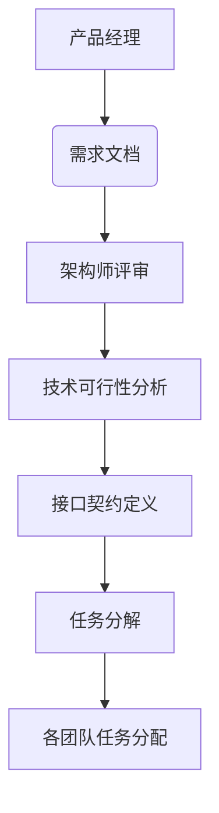
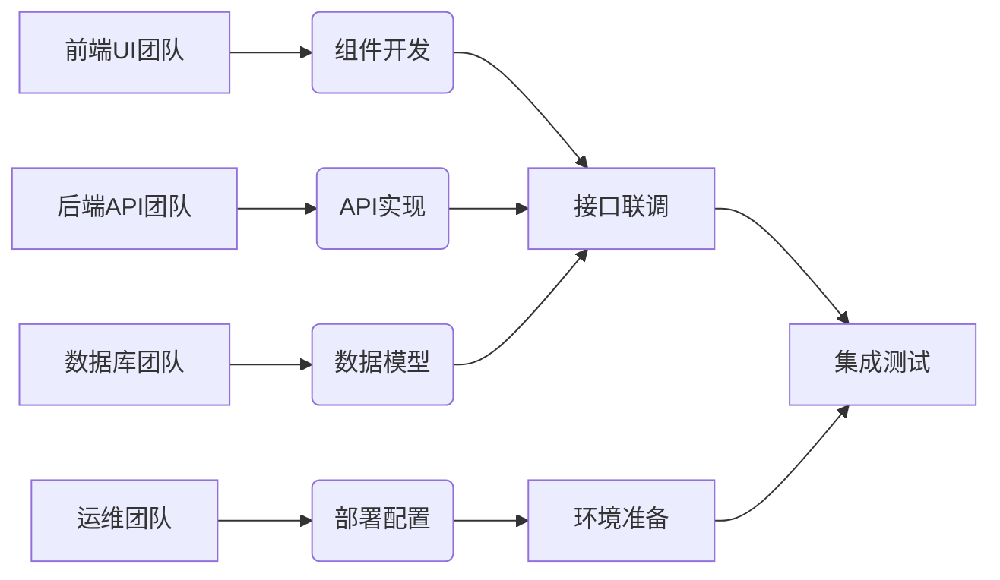
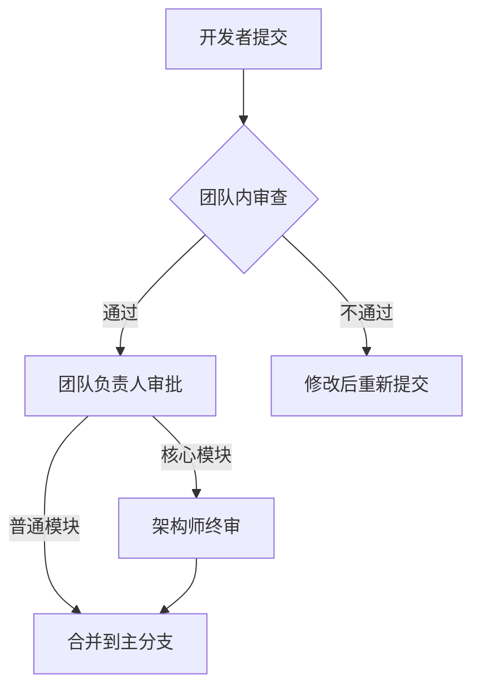
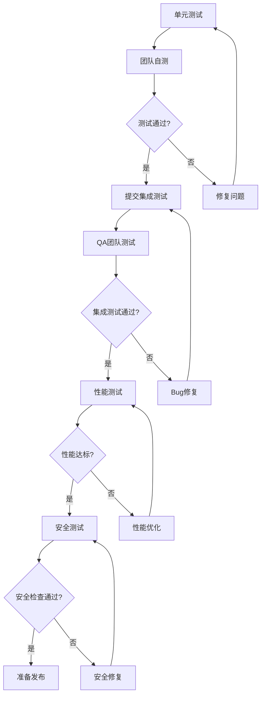
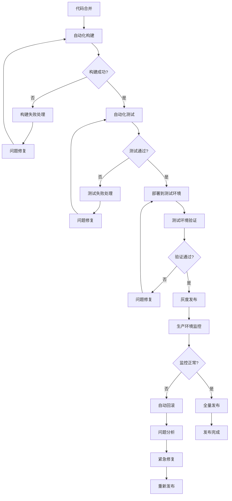
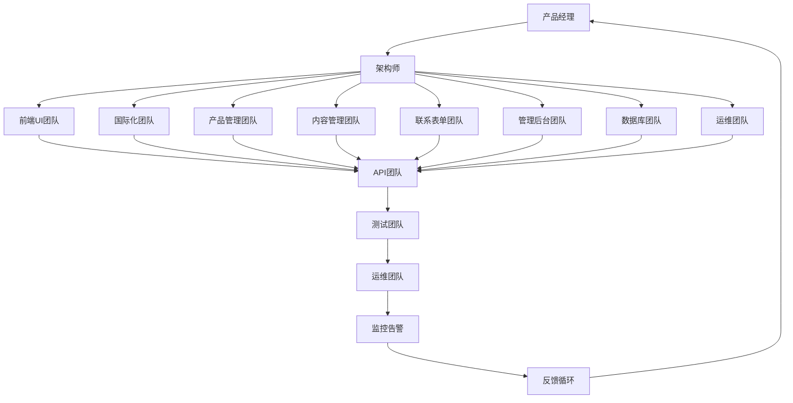
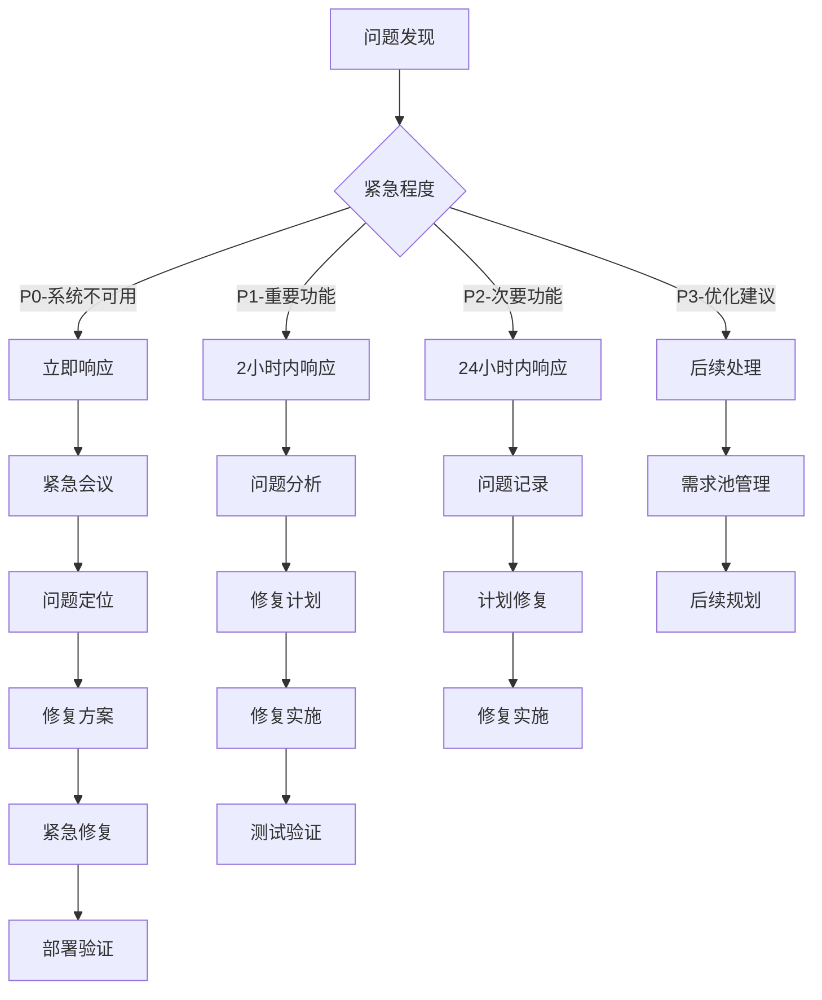
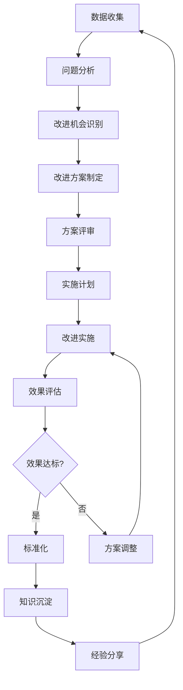

# 模块化团队工作流程图

## 1. 需求管理流程

## 2. 开发协作流程

## 3. 代码审查流程

## 4. 测试流程

## 5. 部署发布流程

## 6. 团队协作关系图

## 7. 问题处理流程

## 8. 持续改进流程

## 流程说明

### 关键节点说明
1. **接口契约定义**: 各团队协作的基础，确保模块间松耦合
2. **代码审查**: 保证代码质量，知识传递的重要环节
3. **自动化测试**: 减少人工测试成本，提高发布质量
4. **灰度发布**: 降低发布风险，确保生产环境稳定
5. **监控告警**: 及时发现问题，快速响应处理
6. **反馈循环**: 持续改进的基础，形成闭环管理

### 时间要求
- 每日站会: 15分钟
- Sprint周期: 2周
- 代码审查: 24小时内完成
- 紧急问题响应: 30分钟内
- 一般问题响应: 2小时内

### 质量标准
- 单元测试覆盖率: >80%
- 代码审查通过率: >95%
- 构建成功率: >99%
- 系统可用性: >99.9%