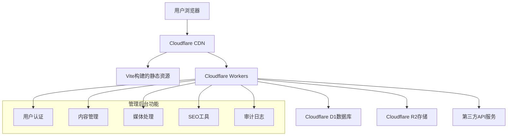

# 后端管理系统技术方案设计

## 架构概述

基于现有 React + TypeScript + Vite 技术栈，构建模块化、可扩展的后端管理系统。系统采用分层架构，包含表示层、业务逻辑层和数据访问层。

## 技术栈

### 前端技术
- **框架**: React 18 + TypeScript
- **构建工具**: Vite 6.x
- **UI组件库**: 自定义组件 + Lucide React 图标
- **状态管理**: React Hook + Context API
- **路由**: React Router v6
- **国际化**: react-i18next
- **表单处理**: React Hook Form
- **拖拽功能**: @dnd-kit/core

### 后端技术
- **数据库**: Cloudflare D1 (SQLite) + 扩展表结构
- **API**: Cloudflare Workers + 增强REST API
- **文件存储**: Cloudflare R2 + 图片处理
- **认证**: JWT + 角色权限系统

### 开发工具
- **代码质量**: ESLint + Prettier
- **类型安全**: TypeScript Strict
- **API客户端**: 增强的d1-api库
- **测试**: Vitest + React Testing Library

## 数据库扩展方案

### 新增数据表结构

```sql
-- 用户权限表
CREATE TABLE users (
    id INTEGER PRIMARY KEY AUTOINCREMENT,
    email TEXT UNIQUE NOT NULL,
    password_hash TEXT NOT NULL,
    full_name TEXT NOT NULL,
    role TEXT NOT NULL DEFAULT 'editor',
    is_active BOOLEAN DEFAULT true,
    last_login TIMESTAMP,
    created_at TIMESTAMP DEFAULT CURRENT_TIMESTAMP,
    updated_at TIMESTAMP DEFAULT CURRENT_TIMESTAMP
);

-- 角色权限表
CREATE TABLE user_roles (
    id INTEGER PRIMARY KEY AUTOINCREMENT,
    name TEXT UNIQUE NOT NULL,
    permissions JSON NOT NULL,
    description TEXT,
    created_at TIMESTAMP DEFAULT CURRENT_TIMESTAMP
);

-- 内容版本历史表
CREATE TABLE content_versions (
    id INTEGER PRIMARY KEY AUTOINCREMENT,
    content_id INTEGER NOT NULL,
    content_type TEXT NOT NULL,
    version_data JSON NOT NULL,
    created_by INTEGER NOT NULL,
    created_at TIMESTAMP DEFAULT CURRENT_TIMESTAMP,
    FOREIGN KEY (created_by) REFERENCES users(id)
);

-- 媒体资源表
CREATE TABLE media_assets (
    id INTEGER PRIMARY KEY AUTOINCREMENT,
    filename TEXT NOT NULL,
    filepath TEXT NOT NULL,
    file_type TEXT NOT NULL,
    file_size INTEGER NOT NULL,
    mime_type TEXT NOT NULL,
    alt_text TEXT,
    caption TEXT,
    metadata JSON,
    created_by INTEGER NOT NULL,
    created_at TIMESTAMP DEFAULT CURRENT_TIMESTAMP,
    updated_at TIMESTAMP DEFAULT CURRENT_TIMESTAMP,
    FOREIGN KEY (created_by) REFERENCES users(id)
);

-- SEO元数据表
CREATE TABLE seo_metadata (
    id INTEGER PRIMARY KEY AUTOINCREMENT,
    page_path TEXT NOT NULL,
    meta_title TEXT,
    meta_description TEXT,
    meta_keywords TEXT,
    og_image TEXT,
    canonical_url TEXT,
    structured_data JSON,
    created_at TIMESTAMP DEFAULT CURRENT_TIMESTAMP,
    updated_at TIMESTAMP DEFAULT CURRENT_TIMESTAMP
);

-- 操作审计日志表
CREATE TABLE audit_logs (
    id INTEGER PRIMARY KEY AUTOINCREMENT,
    user_id INTEGER NOT NULL,
    action_type TEXT NOT NULL,
    resource_type TEXT NOT NULL,
    resource_id INTEGER,
    changes JSON,
    ip_address TEXT,
    user_agent TEXT,
    created_at TIMESTAMP DEFAULT CURRENT_TIMESTAMP,
    FOREIGN KEY (user_id) REFERENCES users(id)
);
```

## 系统模块设计

### 1. 用户权限管理模块
- **用户管理**: CRUD操作、状态管理、登录历史
- **角色管理**: 预定义角色（超级管理员、内容管理员、编辑、查看者）
- **权限控制**: 基于角色的访问控制(RBAC)
- **安全特性**: 密码策略、登录尝试限制、会话管理

### 2. 内容管理增强模块
- **可视化编辑器**: 块编辑器(Block Editor)支持
- **多媒体嵌入**: 支持图片、视频、文档嵌入
- **版本控制**: 自动版本记录、差异比较、回滚功能
- **工作流管理**: 草稿、审核、发布状态管理

### 3. 媒体资源管理模块
- **文件上传**: 拖拽上传、批量上传、进度显示
- **资源库**: 分类标签、搜索过滤、元数据管理
- **图片处理**: 自动缩略图生成、格式转换、优化压缩
- **使用统计**: 文件使用情况、存储空间管理

### 4. SEO管理模块
- **Meta管理**: 批量编辑、模板系统、预览功能
- **性能分析**: Core Web Vitals监控、SEO评分
- **Sitemap管理**: 自动生成、手动调整、提交工具
- **关键词跟踪**: 排名监控、竞争对手分析

### 5. 多语言管理模块
- **翻译工作流**: 待翻译队列、翻译状态跟踪
- **语言包管理**: 导出/导入、机器翻译集成
- **一致性检查**: 缺失翻译检测、内容同步
- **RTL支持**: 阿拉伯语、希伯来语等从右到左语言

## API架构设计

### 增强的REST API端点

```typescript
// 用户管理API
GET    /api/admin/users          // 获取用户列表
POST   /api/admin/users          // 创建新用户
GET    /api/admin/users/:id      // 获取用户详情
PUT    /api/admin/users/:id      // 更新用户信息
DELETE /api/admin/users/:id      // 删除用户

// 权限管理API
GET    /api/admin/roles          // 获取角色列表
POST   /api/admin/roles          // 创建新角色
PUT    /api/admin/roles/:id      // 更新角色权限

// 内容版本API
GET    /api/content/:type/:id/versions  // 获取版本历史
POST   /api/content/:type/:id/revert    // 回滚到指定版本

// 媒体管理API
POST   /api/media/upload         // 上传媒体文件
GET    /api/media                // 获取媒体列表
DELETE /api/media/:id            // 删除媒体文件

// SEO管理API
GET    /api/seo/metadata         // 获取SEO设置
PUT    /api/seo/metadata         // 更新SEO设置
POST   /api/seo/analyze          // SEO分析报告
```

## 安全设计

### 认证授权
- JWT令牌认证
- 角色基础的权限控制
- API速率限制
- CORS策略配置

### 数据安全
- 输入验证和清理
- SQL注入防护
- XSS攻击防护
- 文件上传安全检测

### 审计追踪
- 完整操作日志记录
- 敏感操作二次确认
- 异常行为检测

## 性能优化

### 前端优化
- 代码分割和懒加载
- 图片懒加载和优化
- API请求缓存
- 虚拟滚动列表

### 后端优化
- 数据库查询优化
- 缓存策略(Redis)
- CDN资源分发
- 批量操作支持

## 部署架构



## 监控和维护

### 系统监控
- 错误日志收集
- 性能指标监控
- 用户行为分析
- 存储空间监控

### 维护功能
- 数据库备份/恢复
- 缓存清理
- 日志轮转
- 系统健康检查

## 迁移策略

1. **第一阶段**: 用户权限系统和基础框架
2. **第二阶段**: 内容管理增强和媒体系统
3. **第三阶段**: SEO工具和多语言管理
4. **第四阶段**: 审计日志和高级功能

每个阶段都包含完整的测试和回滚方案，确保平稳过渡。