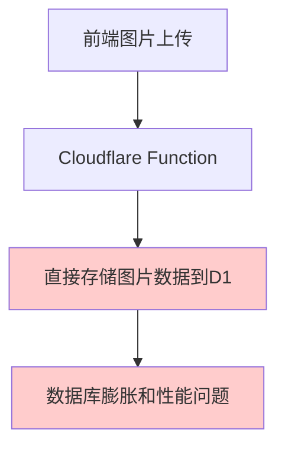
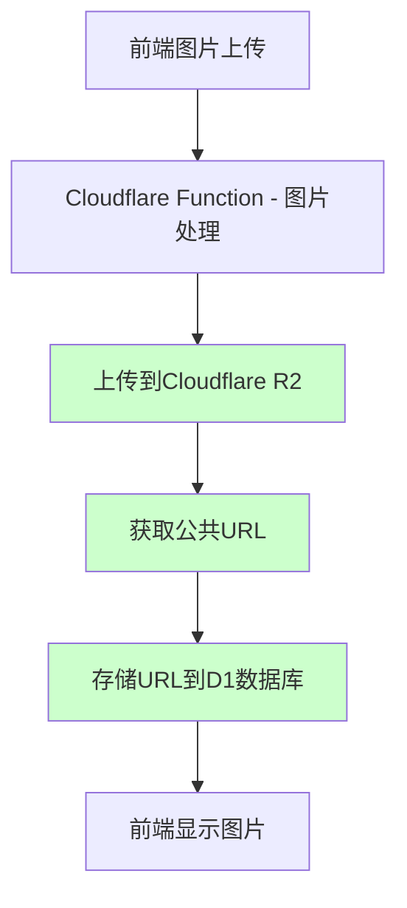
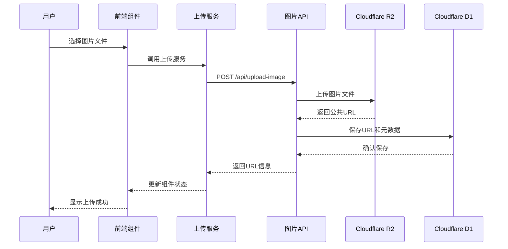
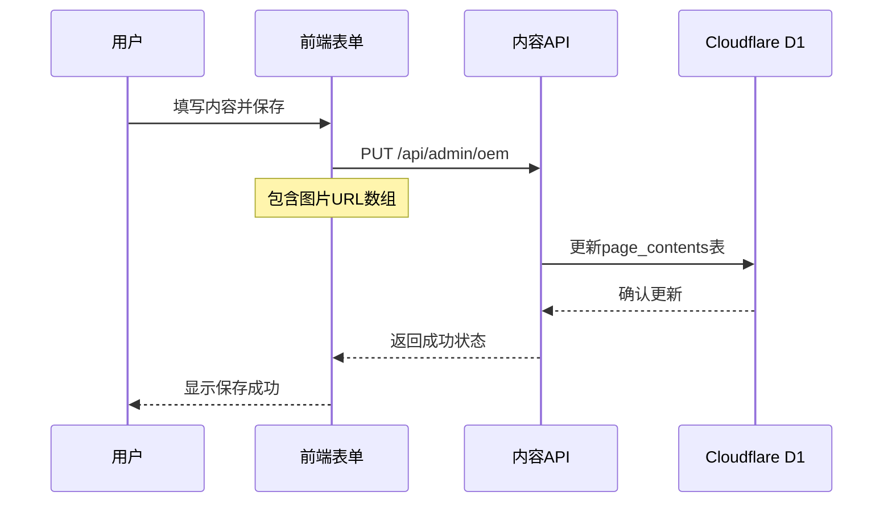

# 技术方案设计 - 图片上传功能修复

## 架构概述

基于Zen和Gemini的共识分析，当前系统的图片上传功能存在根本性的架构缺陷。我们需要从直接在D1数据库存储图片数据的反模式，重构为业界标准的R2对象存储+D1存储URL的架构模式。

## 技术架构

### 现有架构问题



**问题分析：**
1. **性能问题**：直接在D1中存储图片二进制数据导致查询缓慢
2. **扩展性问题**：数据库大小快速膨胀，存储成本高昂
3. **维护问题**：违反行业最佳实践，难以维护和优化
4. **稳定性问题**：大文件可能导致数据库操作超时

### 新架构设计



## 技术栈和组件

### 前端组件

1. **ImageUploader.tsx** - 通用图片上传组件
2. **VideoUploader.tsx** - 视频上传组件（已有）
3. **upload-service.ts** - 统一上传服务
4. **upload-notification.tsx** - 上传通知系统

### 后端API

1. **upload-image.js** - 图片上传专用API（需要重构）
2. **upload-file.js** - 通用文件上传API（已有）
3. **oem.js** - OEM内容管理API（已修复）
4. **home-content.js** - Home内容管理API（需要检查）

### 数据存储

1. **Cloudflare R2** - 图片和视频文件存储
2. **Cloudflare D1** - 元数据和URL存储
3. **page_contents表** - 内容管理数据

## 数据流设计

### 图片上传流程



### 内容保存流程



## 数据库设计

### page_contents表结构

| 字段名 | 类型 | 说明 | 示例值 |
|--------|------|------|--------|
| id | INTEGER | 主键 | 1 |
| page_key | TEXT | 页面标识 | 'oem' |
| section_key | TEXT | 内容区块 | 'oem_images' |
| content_zh | TEXT | 中文内容（JSON数组） | '["url1", "url2"]' |
| content_en | TEXT | 英文内容 | '["url1", "url2"]' |
| content_ru | TEXT | 俄文内容 | '["url1", "url2"]' |
| content_type | TEXT | 内容类型 | 'json' |
| is_active | BOOLEAN | 是否激活 | 1 |
| sort_order | INTEGER | 排序 | 1 |

### R2存储结构

```
kaen/
├── oem/
│   ├── images/
│   │   ├── image1.jpg
│   │   ├── image2.png
│   │   └── ...
│   └── videos/
├── home/
│   ├── images/
│   └── videos/
└── products/
    └── images/
```

## API设计

### 图片上传API - /api/upload-image

**请求方法：** POST
**Content-Type：** multipart/form-data

**请求参数：**
- `file` - 图片文件（必需）
- `folder` - 存储文件夹（可选，默认'images'）
- `category` - 分类（可选，如'oem', 'home'）

**响应格式：**
```json
{
  "success": true,
  "data": {
    "url": "https://kaen.r2.dev/oem/images/image1.jpg",
    "fileName": "image1.jpg",
    "fileSize": 1024000,
    "fileType": "image/jpeg",
    "uploadMethod": "cloudflare_r2",
    "uploadTime": 1250
  }
}
```

### 错误处理

所有API响应都包含详细的错误信息和调试数据：

```json
{
  "success": false,
  "error": {
    "message": "图片上传失败：文件大小超过限制",
    "code": "FILE_SIZE_EXCEEDED",
    "details": {
      "maxSize": "5MB",
      "actualSize": "8MB",
      "debug": "详细调试信息..."
    }
  }
}
```

## 安全考虑

1. **文件类型验证**：严格限制允许的图片格式（JPEG, PNG, WebP, GIF）
2. **文件大小限制**：根据不同类型设置合理的大小限制
3. **访问控制**：所有API都需要有效的认证token
4. **URL安全**：R2公共URL访问需要适当的权限控制
5. **输入验证**：对所有用户输入进行严格验证和清理

## 性能优化

1. **图片压缩**：在上传前自动压缩大尺寸图片
2. **缓存策略**：设置合适的HTTP缓存头
3. **CDN加速**：利用Cloudflare CDN加速图片访问
4. **异步处理**：大文件上传使用异步处理和进度反馈
5. **批量操作**：支持批量上传和管理

## 监控和日志

1. **上传统计**：记录上传成功率、文件大小分布等
2. **错误监控**：实时监控上传错误和异常
3. **性能监控**：监控上传速度和API响应时间
4. **存储监控**：监控R2存储使用情况和成本
5. **审计日志**：记录所有图片管理操作的审计日志